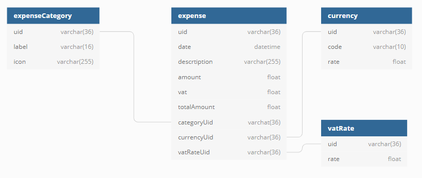

# blueprint-angular-nestjs

Blueprint de base d'une application Angular utilisant NestJS en backend.

L'objectif de cette application est de pouvoir gérer une liste simple de dépense depuis son navigateur à l'aide des frameworks Angular et NestJS et d'une surcouche Ionic.

## Quick Start & Documentation

`git checkout -b monnom` pour tirer une branche a son nom et ne pas polluer master

`npm i` pour installer les différentes dépendances à la racine du projet

`ng serve api` pour démarrer l'api

`ng serve blueprint-angular` pour démarrer l'application angular

## Objectifs du tp

  - Pouvoir ajouter une dépense
  - Gérer une liste d'ajout / suppression / modification de dépenses
  - Trier la liste par date de la dépense
  - Stocker en local la liste des dépenses
  - Avoir une barre de recherche pour trier des dépenses via libellé
  - Pouvoir persister en base les dépenses
  - Pouvoir récupérer les dépenses de l'utilisateur à l'arrivée sur l'application
  - Alert l'utilisateur lors de différents évenements au sein de l'application via une snackbar / un toast
  - Sauvegarder localement les dépenses afin de pouvoir les lire en mode hors ligne
  - Supprimer les données locales si on le souhaite
  - Récuperer les types de catégorie de référence depuis la base de donnée
  - Afficher le total d'une liste de dépenses
  - Avoir des dépenses ayant des devises différentes
  - Disposer d'un taux de TVA puisé dans une table de référence

## MPD

## Détail des fonctionnalités

* ### Ajout d'une dépense

  On doit disposer d'un bouton permettant d'ajouter une dépense.

  En cliquant dessus une modale s'ouvre me demandant de chosir la catégorie.

  Lorsque je choisis ma catégorie je dois avoir une champ de recherche pour les filtrer si je le souhaite.

  Une fois ma catégorie selectionnée je suis rediriger sur un écran qui dispose d'un formulaire permettant de remplir ma dépense.
  
  Une fois ma dépense ajoutée je suis redirigé sur la liste des dépenses qui se mettra à jour

* ### Liste des dépenses

  Liste d'éléments ou chaque élément est une dépense.

  Celle ci se trouve sur la page principal de l'application.

  La liste doit trier les dépenses suivant la date à laquelle elle se rapporte et non celle de création.

  On doit pouvoir sur chaque dépenses effectuer des actions de crud basiques.
  C'est à dire la lecture, la modification et la suppression.

  Je dois pouvoir synchroniser ma liste de dépenses avec celle en base de données via une action ou cela doit se faire manière cyclique.
  
  Je dois avoir le total TVA et TTC affiché quelque part
  
  Si j'ai des dépenses en devise étrangère je souhaite que le cumul soit fait via le cours devise et la date de la dépense

  * #### Lecture

  Je suis rediriger vers une page me montrant le détail de ma dépense.

  Je dois être en mesure de savoir si la dépense est locale ou non.

  Les seules actions possibles à ce moment sont le passage en modification et la suppression.

  * #### Modification

  Ma page devient un formulaire me permettant de modifier ma dépense.

  Ma dépense doit se synchroniser avec la base de données en cas de modification.

  * #### Suppression

  A la suppression une popup de confirmation me demande de valider mon choix.
 
  Je suis alerter en cas de problème ou de succès lors de la suppression.

  * #### Recherche de dépense

  Ma liste doit disposer d'une barre de recherche qui me triera mes dépense en se basant sur le libellé.
  
  Il faut que je sois averti si aucune dépense n'est retrouvé dans ma recherche.
  
* ### Backend
  
  Récupérer les catégories de dépense
  
  Récupérer mes dépenses actuelles
  
  Récupérer les cours devise
  
  Récupérer les taux de tva
  
  Ajouter une dépense
  
  Supprimer une dépense
  
  Mettre à jour une dépense
  

* ### Interactions utilisateur

  * #### Snackbar / Toast

  Lorsque l'utilisateur effectue des actions mettant en action de la persistance ou des erreurs, une snackbar doit apparaitre pour l'informer.

  * #### Touch Gestures

  L'implémentation des touch gestures en rapport avec le crud des dépenses depuis la liste est un plus. Pour cela utiliser HammerJS.

## Notes

  Il n'est pas nécessaire de suivre l'ensemble du détail des fonctionnalités dans leur ensemble, elles servent surtout de guidelines

  Calcul de la TVA : TVA = TTC / 100 * Taux TVA
  
  Chaine de connexion de la base de données :
  
  Documentation de NestJS : https://docs.nestjs.com/
  
  Documentation d'Angular : https://angular.io/docs
  
  Documentation d'Ionic : https://ionicframework.com/docs
